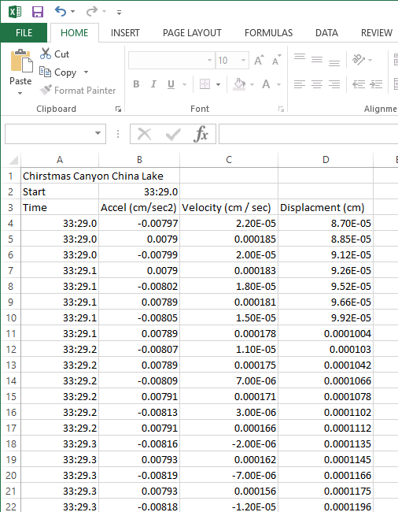
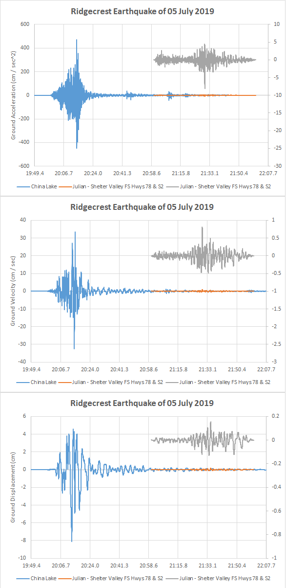

# StrongMotionData2
Program to Parse a strong motion data version two earthquake data and convert it to a multi column csv file.

Earthquake data from https://strongmotioncenter.org/ is a great resource and can allow you to gain lots of
insight into earthquakes that may happen in your area. However I have had trouble using MS Excel to parse the
data due to its format.  In general its a fixed 10 digit format, (but at least with the Excel version I have) Excel
can only parse fixed format with a space delmiter.  For data sets of smaller magnitude data Excel can work if
there is always a space between the data samples.  This is not always the case in larger magnitude earthquakes
when the data samples are negative:

                -146.14290 -62.53206  48.01688 -46.14147-169.14630-123.80730 -94.15871-110.54650

As you can see in those samples with 3 digits to the left of the decimal, the negative sign is in this case the
delimiter. If you use sapce and '-' as delimters in Excel the negative sign is lost...

To solve this problem, the program in this repository uses a RegEx expsression to parse the data and will extract
postive and negative data samples while maintaining the intergrity of the sign.

                string dataPattern = @"[-]?[0-9]*[.]{1}[0-9]+";
                m = Regex.Match(dataLine, dataPattern);
                
The data is then written to a CSV file which is easy for Excel to import.

Shown below is an example csv file imported into Excel:

Some plots made from the CSV data:

